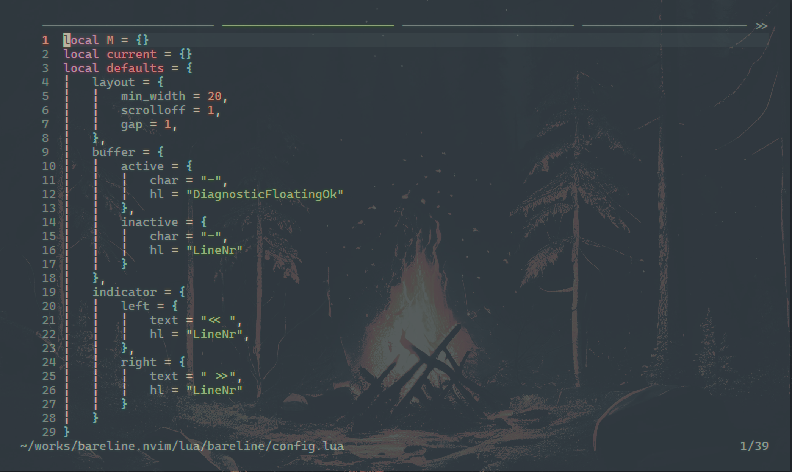
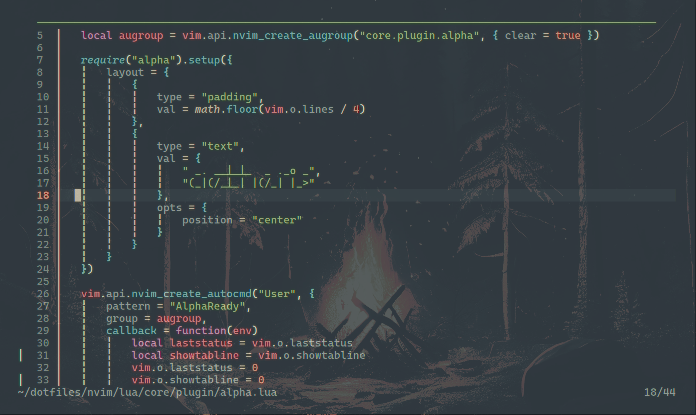

# bareline.nvim
## Introduction

A minimal Neovim buffer indicator for users who do not want a full bufferline. **NO FILENAME, NO ICONS, NO DIAGNOSTICS, NO GIT STATUS, NO CLOSE BUTTONS, BUT ONLY INDICATORS.**

| Multiple Buffers | Single Buffer |
|---|---|
|  |  |

**Why?**

* File names are useful, but not always worth the space.
* A crowded bufferline is often harder to scan than a picker.
* Diagnostics, Git status, and file metadata are better shown on demand.
* A quiet tabline keeps attention on the current buffer.
* `bareline.nvim` gives just enough spatial feedback: where the active buffer is, and whether more buffers exist off-screen.

## Features

bareline is fairly simple:

* **Dynamic width**: Buffer indicators expand or shrink to fill the tabline cleanly.
* **Only indicators** No filenames, icons, diagnostics, Git status, close buttons, or extra metadata.

## Configs

```lua
require("bareline").setup({
    -- all opitons are here
	layout = {
        -- mininum width a buffer could shrinks to
		min_width = 20,
        -- see :help 'scrolloff'
		scrolloff = 1,
        -- gap between buffers
		gap = 1,
	},
	buffer = {
		active = {
			char = "-",
			hl = "DiagnosticFloatingOk"
		},
		inactive = {
			char = "-",
			hl = "LineNr"
		}
	},
    -- shown when there are more buffers are left/right
    -- if no more, smae amount whitespaces will be displayed
	indicator = {
		left = {
			text = "<< ",
			hl = "LineNr",
		},
		right = {
			text = " >>",
			hl = "LineNr"
		}
	}
})

```
